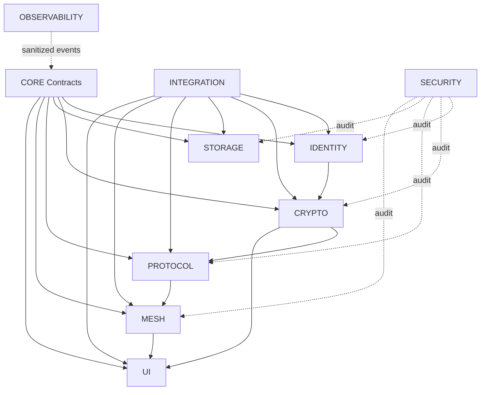

# Eagle Dependency Graph

**Status:** Proposed planning artifact  
**Governing issue:** ARCH-001  
**Governing ADR:** ADR-0007

## Graph

## Core constraints
- Mesh never handles application plaintext.
- Protocol never handles application plaintext.
- Storage never exposes private keys.
- UI never accesses private keys or crypto internals.
- Crypto and Mesh must not form a circular dependency.
- Storage does not define Protocol.

Solid edges are dependency direction; dashed edges are audit relationships.