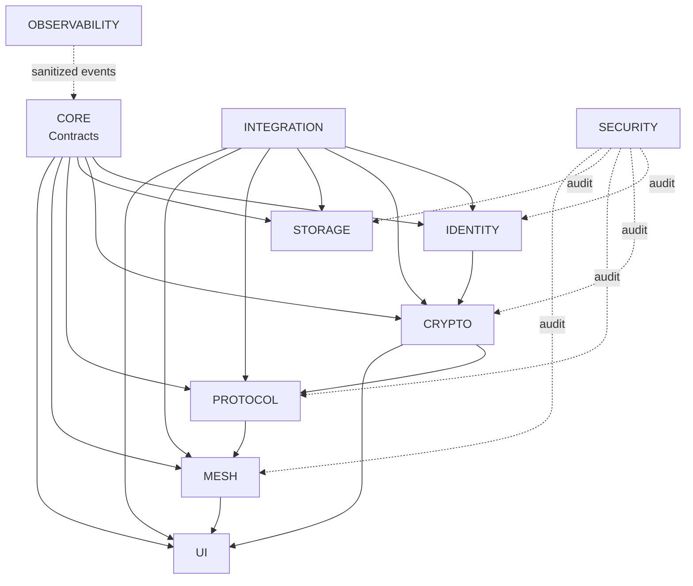

# Eagle Dependency Graph

**Status:** Proposed planning artifact  
**Governing issue:** ARCH-001  
**Governing ADR:** ADR-0007

## Reading guide

- Solid arrows (`→`) describe allowed dependency direction.
- Dashed audit edges (`-. audit .->`) describe security inspection, not runtime ownership.
- `integration` wires implementations; it does not own domain logic.
- `security` verifies and audits; it does not become an application implementation layer.

## Canonical graph

## Enforcement rules

### Allowed

- core → no implementation-specific dependency
- identity → core
- crypto → core + identity contracts
- protocol → core + crypto contracts
- storage → core
- mesh → core + protocol contracts
- ui → core + application services
- integration → implementations for wiring only
- security → read / test / audit
- observability → sanitized contracts

### Denied

- UI → Android Keystore
- UI → crypto implementation internals
- UI → database internals
- Mesh → plaintext
- Mesh → database internals
- Storage → UI
- Identity → UI
- Crypto ↔ Mesh circular dependency
- Storage → Protocol

## Security data flow

### Send

`plaintext → crypto → encrypted envelope → protocol → mesh → transport`

### Receive

`transport → mesh → protocol → crypto → plaintext → application/UI`

### Non-negotiable boundary

- mesh must not process application plaintext
- protocol must operate on encrypted envelopes / framing, not application plaintext
- storage must not expose private keys
- UI must not access private keys
- logs / telemetry must not contain plaintext or secrets

This document does not choose concrete libraries or algorithms.
