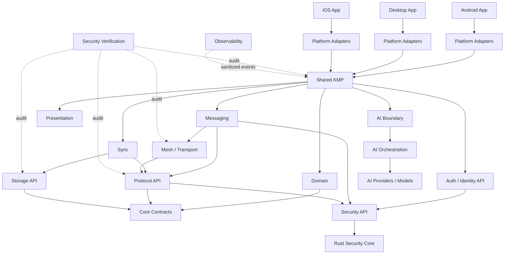

# Eagle Dependency Graph — Architecture V2

**Status:** Proposed implementation baseline  
**Scope:** target dependency boundaries for the migration from the current single `:app` module to a multiplatform architecture.  
**Current repository state:** only `:app` is an actual Gradle module; the graph below is a target architecture, not a claim that these modules already exist.

## 1. Target graph

## 2. Dependency rules

### Platform boundary
- Platform applications depend on shared contracts and platform adapters.
- Shared/domain code must not depend on Android, iOS, or desktop UI APIs.
- Platform-specific capabilities enter through explicit adapters/interfaces.
- No platform app may call Rust internals directly when the shared security API can provide the required operation.

### Shared boundary
- `shared/domain` owns product/application concepts and use-case contracts.
- `shared/auth`, `shared/messaging`, and `shared/sync` compose domain behavior; they do not own platform storage or cryptographic implementations.
- `shared/presentation` may depend on application/domain contracts but not on private keys, crypto internals, or database internals.

### Security boundary
- `core/security` exposes narrow, testable security contracts.
- `rust/security-core` owns security-sensitive implementation that is intentionally isolated behind the security API/FFI boundary.
- Private keys never cross into UI/presentation.
- Mesh, protocol, storage, and AI never receive unrestricted access to private-key material.
- AI has no dependency on the Rust security implementation.

### Protocol / mesh / storage
- Protocol handles envelopes, framing, serialization, and versioning contracts; it does not handle application plaintext.
- Mesh handles discovery/transport/routing and must not require application plaintext.
- Storage owns persistence through repository/storage contracts and does not define protocol semantics.
- Crypto/security and mesh must not become a circular dependency.

### AI boundary
- `ai/domain` defines AI-facing application contracts.
- `ai/orchestration` coordinates models/tools under explicit permissions.
- `ai/providers` contains replaceable provider/model integrations.
- AI may request approved application capabilities through interfaces; it must not bypass domain/security boundaries.
- Disabling or replacing AI must not break core messaging, identity, protocol, storage, or security.

## 3. Mapping from the existing planning baseline

| Existing planning concept | Architecture V2 destination |
|---|---|
| core | `core/contracts` + selected shared domain contracts |
| identity | `shared/auth` + `core/security` contracts |
| crypto | `core/security` + Rust implementation |
| protocol | `shared/messaging` / protocol package |
| storage | storage API + platform implementations |
| mesh | transport/mesh package + platform adapters |
| ui | platform apps + shared presentation |
| integration | dependency wiring / platform composition |
| security | verification, audit, security gates |
| observability | sanitized cross-platform observability contracts |
| documentation | `docs/03-architecture/` |

This mapping is intentionally transitional. It does **not** require creating one Gradle module for every conceptual domain.

## 4. Migration rule

Do not create all target directories/modules at once.

The migration should proceed by dependency boundary:

1. Define contracts.
2. Add the smallest shared module that can host those contracts.
3. Move one vertical slice.
4. Keep `:app` buildable.
5. Add tests around the moved boundary.
6. Verify dependency direction.
7. Repeat.

A temporary compatibility layer is acceptable during migration when it reduces risk and is explicitly tracked for removal.

## 5. Non-goals

This graph does not:
- approve a cryptographic algorithm;
- approve a transport protocol;
- select an AI vendor/model;
- claim iOS, desktop, or web modules already exist;
- replace ADR decisions with implementation assumptions.

Those decisions remain governed by the ADR process.

## 6. Architectural gates

Before declaring the migration complete:

- [ ] No UI/private-key dependency.
- [ ] No mesh/application-plaintext dependency.
- [ ] No storage/private-key exposure.
- [ ] No security ↔ mesh circular dependency.
- [ ] No AI → security implementation dependency.
- [ ] Shared code builds independently of Android UI.
- [ ] Platform-specific code is isolated behind adapters.
- [ ] Required test categories remain explicitly tracked as PASS or PENDING.
- [ ] CI verifies the dependency rules rather than relying only on documentation.
