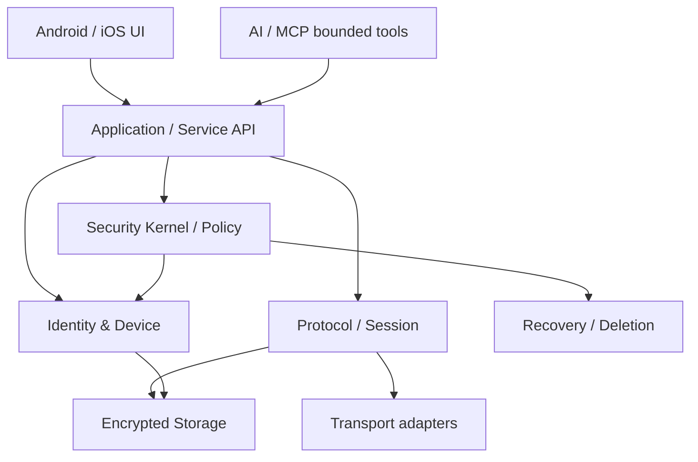

# Eagle — System Architecture Baseline

Status: **IMPLEMENTATION BASELINE — NOT PRODUCTION CERTIFICATION**

The architecture follows the reviewed project baseline. Security policy remains authoritative and higher layers must use stable contracts.

## Layered architecture

## Security authority

- Authentication, authorization, trust state, key lifecycle, session state, downgrade rejection, recovery policy, deletion policy and AI/tool authority are security-policy concerns.
- UI/business logic must not reach directly into cryptographic or trust internals.
- AI/MCP can prepare candidates and invoke declared capabilities only; it cannot override deterministic security policy.
- No custom cryptography is introduced by this implementation pass.

## Current implementation boundary

This pass implements only deterministic state/policy primitives that do not require unresolved protocol decisions. Signal/PQXDH/MLS/transport/retention/device-linking/recovery/deletion guarantees remain behind their documented decision gates.
