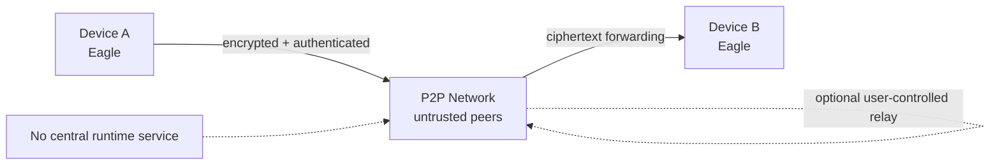
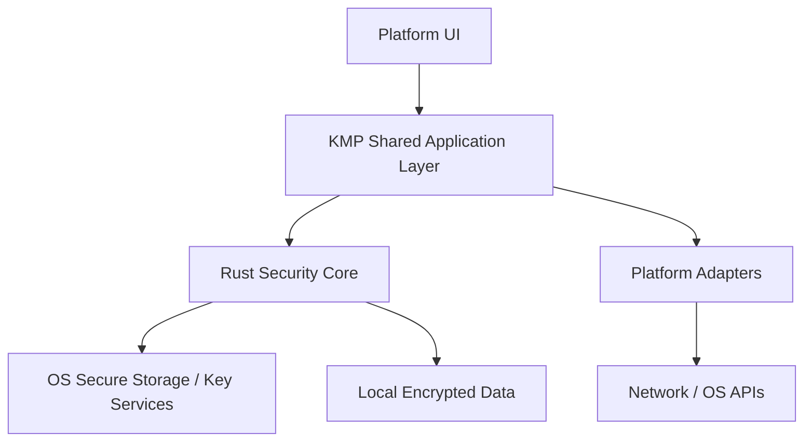
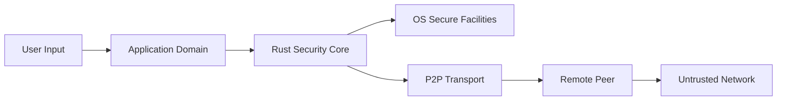
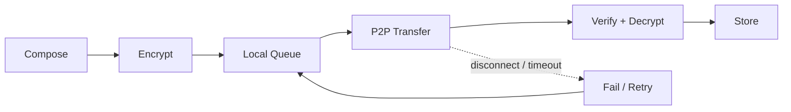
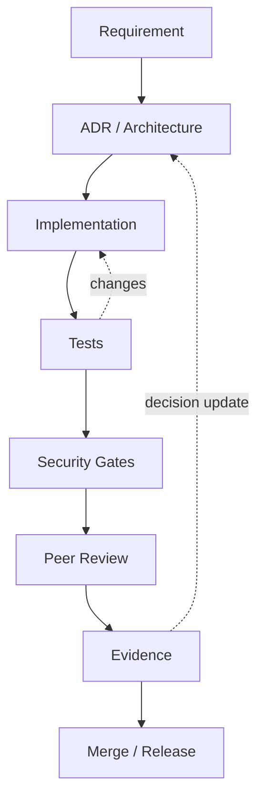
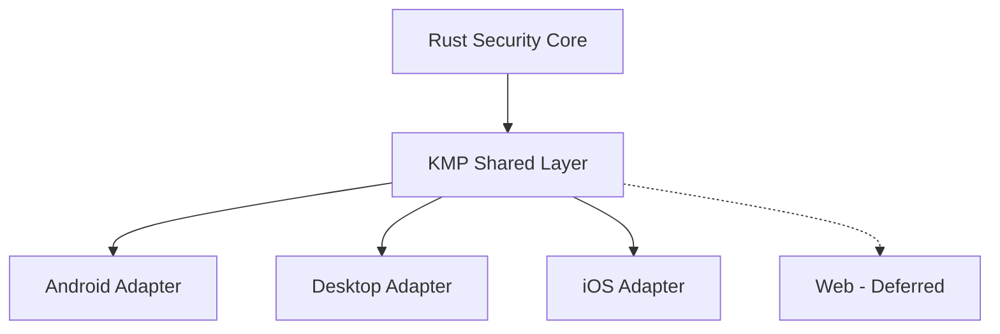

# Eagle Execution Pack - Diagram Sources

These diagrams are implementation handoff views. They complement, and do not override, accepted ADRs.

## 1. System context

## 2. Layered architecture

## 3. Trust boundaries

## 4. Message lifecycle

## 5. Engineering gate

## 6. Platform boundary

