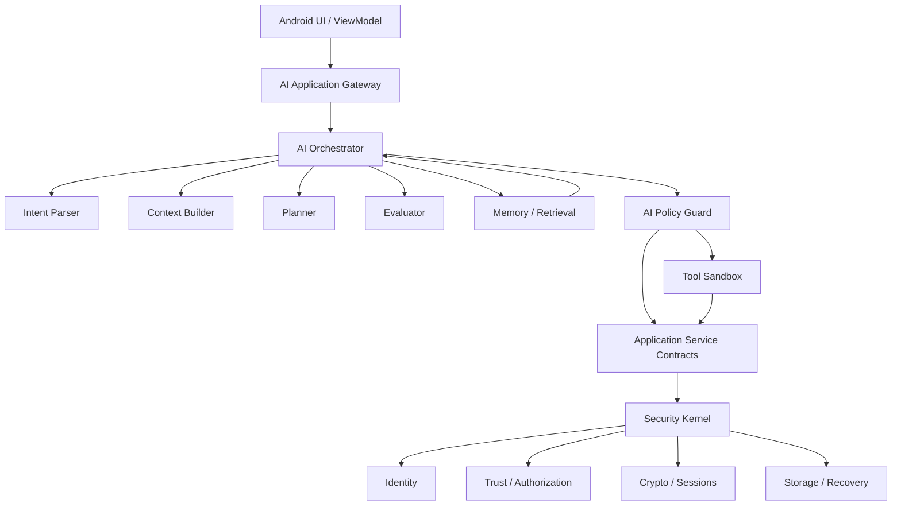
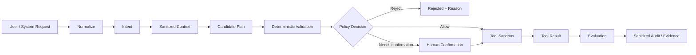

# Eagle AI Architecture V1 — Proposed

## Status

**Proposed — architecture/design work only.**

This document defines the initial AI boundary for Eagle. It does not add an LLM runtime, provider SDK, model weights, network service, or production AI execution path.

## Governing principle

AI is an **advisory and orchestration layer**. The Security Kernel remains the sole authority for identity, trust, authorization, key usage, cryptographic state, and security policy.

AI may interpret, retrieve, classify, plan, and evaluate.

AI must not:

- access cryptographic keys or secret key material;
- change trust state or security policy;
- authorize itself or another actor;
- directly invoke cryptographic primitives;
- bypass application authorization;
- declare its own output independently verified;
- create or redefine executable tools at runtime.

## Dependency boundary

The existing Eagle planning baseline keeps UI above application services and keeps security authority in deterministic policy/kernel paths. AI follows the same boundary.



## Cognition pipeline



## Core contracts

The first implementation should introduce platform-neutral contracts similar to:

```rust
pub struct AiRequest {
    pub request_id: RequestId,
    pub source: RequestSource,
    pub content: SanitizedInput,
}

pub struct AiPlan {
    pub plan_id: PlanId,
    pub steps: Vec<PlanStep>,
    pub confidence: ConfidenceAssessment,
    pub requires_confirmation: bool,
}

pub struct PlanStep {
    pub capability: CapabilityRequest,
    pub arguments: SafeArguments,
}
```

The AI model receives no direct reference to Security Kernel state or mutable security objects.

## Adapter model

```text
AiGateway
   |
   +-- RuleBasedAdapter
   +-- TestAdapter
   +-- LocalModelAdapter
   +-- RemoteModelAdapter
```

All adapters are untrusted from the Security Kernel perspective. A model provider must be replaceable without changing security contracts.

## Memory model

AI memory is separated from Eagle's authoritative secure storage semantics:

- Working memory: short-lived context.
- Episodic memory: bounded observations, decisions, actions, and outcomes.
- Semantic memory: derived knowledge with explicit provenance.
- Evidence memory: evidence identifiers and provenance metadata.

The existing deterministic SelfModel foundation should remain below the LLM boundary and should be fed only sanitized, bounded observations.

## Release boundary

No production AI capability is considered complete until:

1. tool requests are schema-validated;
2. authorization is enforced outside the model;
3. prompt injection tests exist;
4. secret/PII leakage tests exist where applicable;
5. failure paths are fail-closed;
6. evidence IDs can connect AI decisions to deterministic verification;
7. the relevant CI/Test Lab evidence passes.
