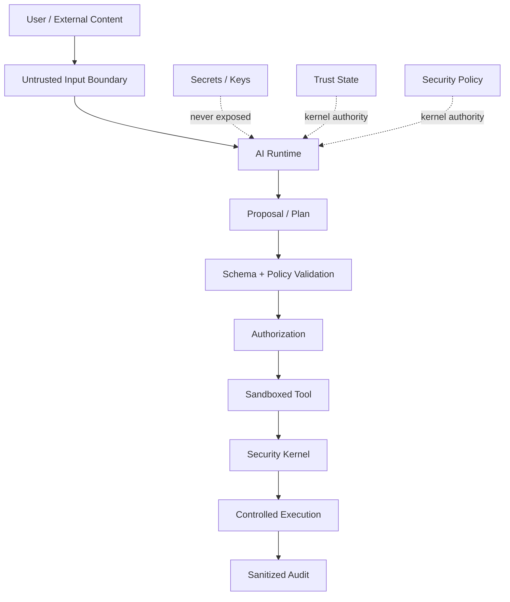

# Eagle AI Security Boundary V1 — Proposed

## Security rule

**AI output is untrusted input until validated by deterministic policy and authorization.**

This rule applies to local models, remote models, retrieved content, memory, files, and tool results.

## Trust boundaries



## Prompt injection model

Messages, attachments, retrieved documents, and remote model output are data, not trusted instructions.

Required controls:

- system/developer instructions are separated from untrusted content;
- retrieved content cannot create new tools;
- model output cannot rewrite policy;
- tool registry is static and application-controlled;
- sensitive operations require independent authorization;
- audit records must exclude keys and secrets;
- parsing and size limits apply before model ingestion.

## Capability model

Use explicit capability requests instead of arbitrary function calls.

Example:

```text
CapabilityRequest::CreateDraft
CapabilityRequest::SearchConversation
CapabilityRequest::SendMessage
CapabilityRequest::DeleteConversation
CapabilityRequest::ChangeTrust   <- never granted to AI
CapabilityRequest::ExportKey    <- never granted to AI
```

High-risk capabilities require either explicit human confirmation or a non-AI policy path.

## Risk tiers

| Tier | Example | AI behavior |
| --- | --- | --- |
| Low | summarize visible content | may execute automatically |
| Medium | create a draft | produce result for review |
| High | send/delete application data | confirmation / explicit authorization |
| Critical | trust changes, key export, identity destruction | Security Kernel only |

## Confidence

Model confidence is only one signal.

```text
model score
   +
evidence quality
   +
schema validity
   +
consistency
   +
policy result
   -> system assessment
```

The AI cannot self-promote its confidence or mark its own output as verified.

## Fail-closed behavior

On any of the following, the action stops:

- unknown capability;
- malformed arguments;
- missing authorization;
- ambiguous critical intent;
- stale plan;
- invalid policy context;
- suspicious replay;
- unavailable required security state.

The user-visible result may explain that the action was rejected, but must not expose secrets or internal security material.

## Security tests

The first AI security test suite should cover:

- prompt injection attempting key access;
- prompt injection attempting trust changes;
- tool hallucination / unknown tool requests;
- schema bypass;
- stale-plan replay;
- unauthorized capability invocation;
- secret leakage to memory;
- secret leakage to logs;
- model-generated policy override;
- denial handling and fail-closed behavior.

## Non-goals

This document does not approve:

- a specific LLM provider;
- a specific model;
- production E2EE integration through AI;
- autonomous security decisions;
- autonomous identity or trust management;
- unrestricted MCP execution.

Those decisions require their own evidence, review, and architecture records.
