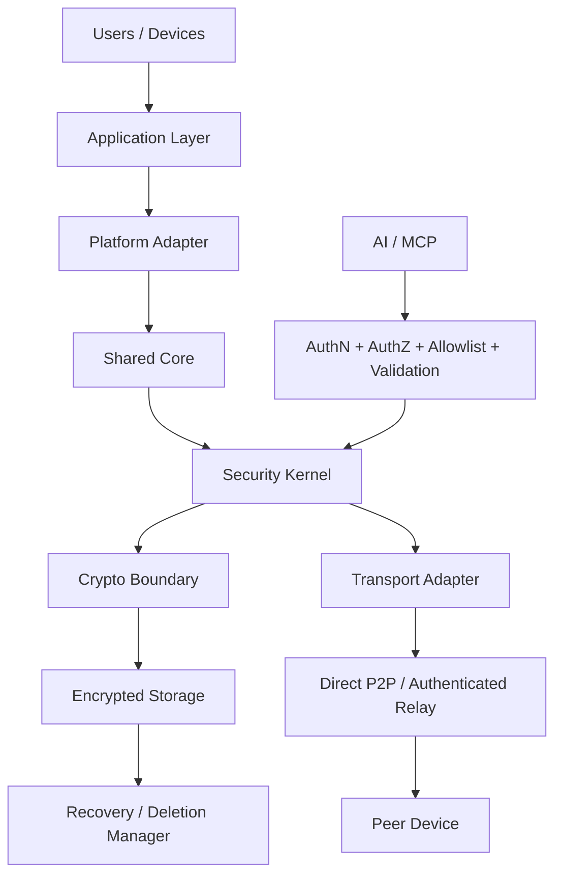

# 01 — System Architecture



### Trust boundaries

- The network is untrusted.
- Relay infrastructure may forward ciphertext but must not receive E2E plaintext or private keys.
- The security kernel is the authorization boundary.
- Persistent state is encrypted and subject to deletion guarantees.

### Implementation target

```text
apps/
core/
crypto/
transport/
storage/
api/
shared/
test-vectors/
integration-tests/
fuzz/
security/
docs/
scripts/
```
