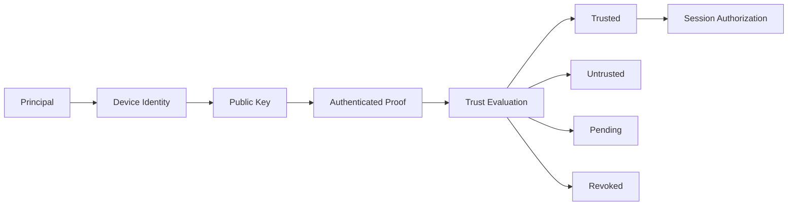
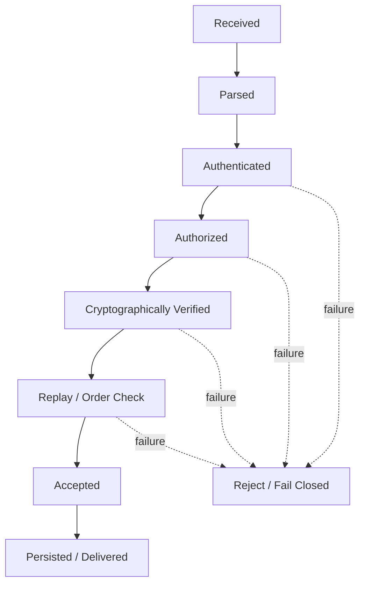

# 02 — Trust, Identity and Message Flow

## Identity and trust

```mermaid
flowchart LR
  P[Principal] --> D[Device Identity]
  D --> K[Public Key]
  K --> AP[Authenticated Proof]
  AP --> TE[Trust Evaluation]
  TE --> T[Trusted]
  TE --> U[Untrusted]
  TE --> PN[Pending]
  TE --> R[Revoked]
  T --> S[Session Authorization]
```

## Message lifecycle

```mermaid
flowchart TD
  R[Received] --> P[Parsed]
  P --> A[Authenticated]
  A --> Z[Authorized]
  Z --> V[Cryptographically Verified]
  V --> O[Replay / Order Check]
  O --> X[Accepted]
  X --> D[Persisted / Delivered]
  A -. failure .-> F[Reject / Fail Closed]
  Z -. failure .-> F
  V -. failure .-> F
  O -. failure .-> F
```

Every failure path is a rejection path unless an explicit normative contract says otherwise.
