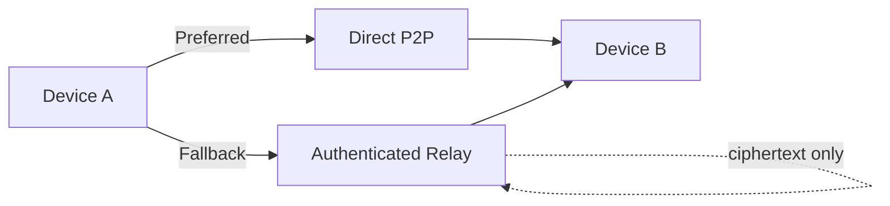
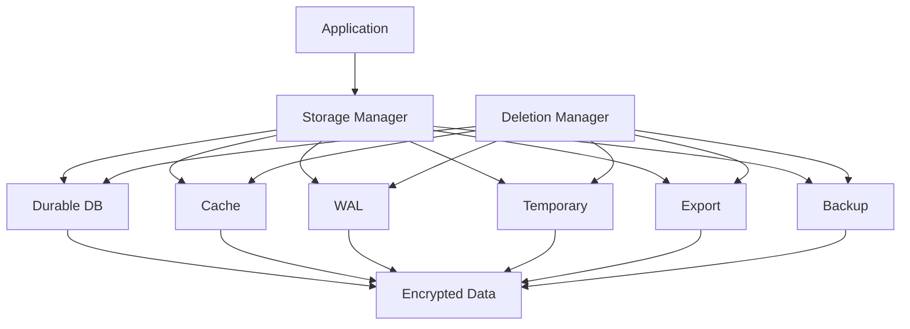
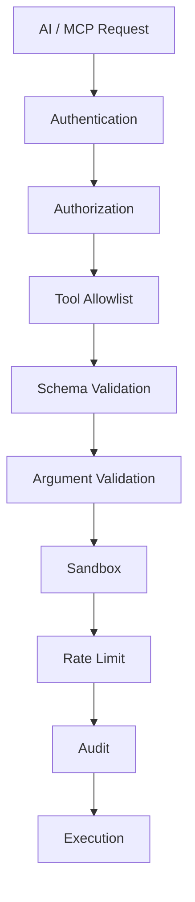

# 03 — Network, Storage and AI/MCP

## Network

## Storage and deletion

Deletion is not complete until all persistence paths covered by the approved V1 contract are handled.

## AI/MCP

AI must not bypass the security kernel or directly access protected resources.
