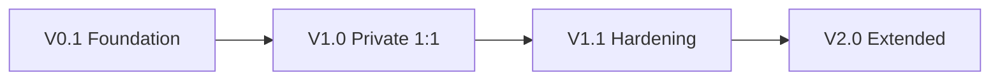

# 04 — Release Architecture Roadmap

### V0.1
Security state machine, policy primitives, repository structure, CI, test/evidence framework.

### V1.0
Identity/device trust, approved cryptography, authenticated 1:1 sessions, Direct P2P with authenticated relay fallback, encrypted storage, recovery and deletion.

### V1.1
Fuzzing, property testing, interoperability, failure injection, crash recovery, performance and independent verification.

### V2.0
Group/MLS and scaling only after an explicit scope decision, threat-model delta, ADRs and compatibility plan.
